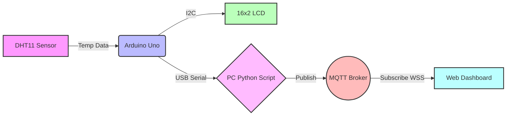
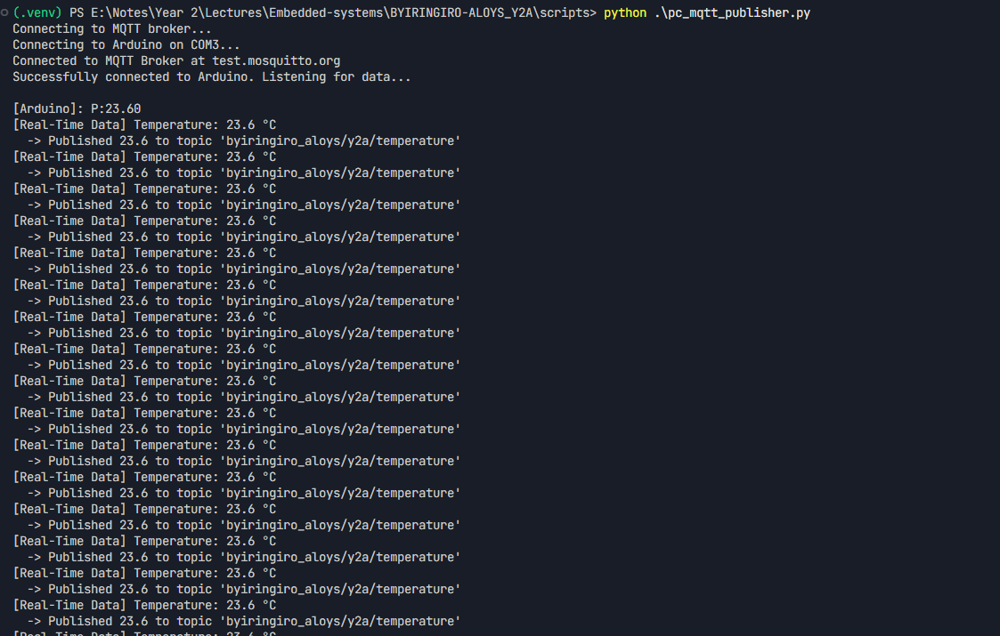
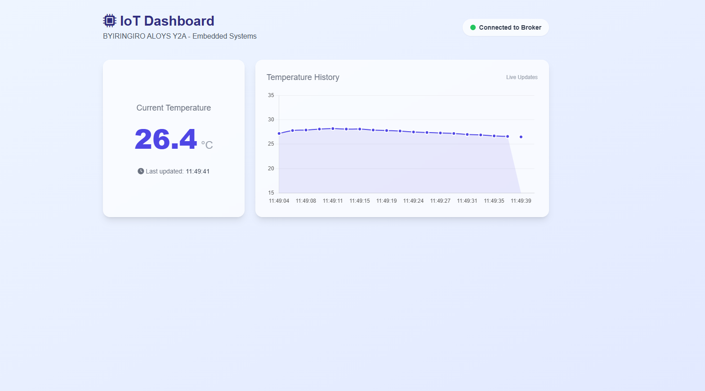

# IoT Temperature Monitoring System

**Candidate:** BYIRINGIRO ALOYS Y2A  
**Module:** Embedded Systems  

## 📌 Project Overview
This project is an end-to-end embedded system designed to read temperature data, display it locally on an LCD, transmit it to a PC via USB Serial, and publish it to an MQTT broker. Finally, a real-time web dashboard visualizes the live temperature data.

### 🔄 System Architecture & Flow



*(Data flows from the sensor to the microcontroller, is displayed locally, forwarded via USB to a PC, published to the cloud, and visualized on a web client).*

---

## 🛠️ Hardware Configuration

*   **Microcontroller:** Arduino Uno
*   **Sensor:** DHT11 Temperature & Humidity Sensor
    *   `Signal (S)` ➔ `D2`
    *   `VCC` ➔ `5V`
    *   `GND` ➔ `GND`
*   **Display:** 16x2 I2C LCD
    *   `SDA` ➔ `A4`
    *   `SCL` ➔ `A5`
    *   `VCC` ➔ `5V`
    *   `GND` ➔ `GND`

---

## 🚀 How to Run the Project

### Part 1: Arduino Setup
1. Open `arduino_code/arduino_code.ino` in the Arduino IDE.
2. Install required libraries via Library Manager (`Sketch` -> `Include Library` -> `Manage Libraries`):
   * `DHT sensor library` by Adafruit (Install all dependencies)
   * `LiquidCrystal I2C` by Frank de Brabander
3. Select your Arduino Uno board and COM port, then click **Upload**.
4. The LCD will display the scrolling candidate name on the first row and the temperature on the second row.

### Part 2: PC MQTT Publisher
The PC script reads the serial data from the Arduino and publishes it to a public MQTT broker (`test.mosquitto.org`).
1. Open a terminal/PowerShell in the project folder.
2. Activate your virtual environment (if using one) and install the required Python packages:
   ```bash
   pip install pyserial paho-mqtt
   ```
3. Open `pc_mqtt_publisher.py` and ensure the `SERIAL_PORT` variable matches your Arduino's COM port (e.g., `COM3`).
4. Run the script:
   ```bash
   python pc_mqtt_publisher.py
   ```

### Part 3: Web Dashboard
The web dashboard connects directly to the MQTT broker via WebSockets to display real-time data.
1. Open the `dashboard/index.html` file in any modern web browser.
2. The dashboard will automatically connect and chart the incoming temperature data.

---

## 📸 Execution Screenshots

*(Add your screenshots below to demonstrate successful execution)*

### 1. Hardware Setup & Arduino Execution
> *Description: Hardware connected properly. The LCD displays the scrolling name and temperature.*
> 
> *<-- Insert Hardware / LCD Photo Here -->*
> 

### 2. Python Script Terminal
> *Description: The Python script reading serial data and successfully publishing to the Mosquitto MQTT broker.*
> 
> *<-- Insert Terminal Screenshot Here -->*
> 

### 3. Real-Time Web Dashboard
> *Description: The browser dashboard connected via WebSockets, receiving the live MQTT stream and charting the temperature.*
> 
> *<-- Insert Web Dashboard Screenshot Here -->*
> 
